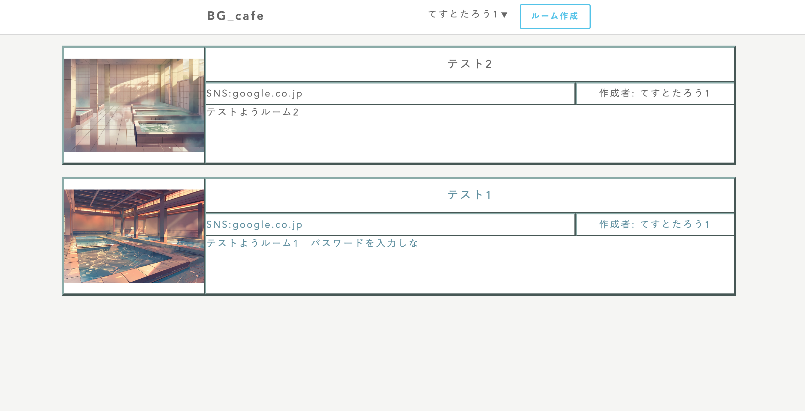
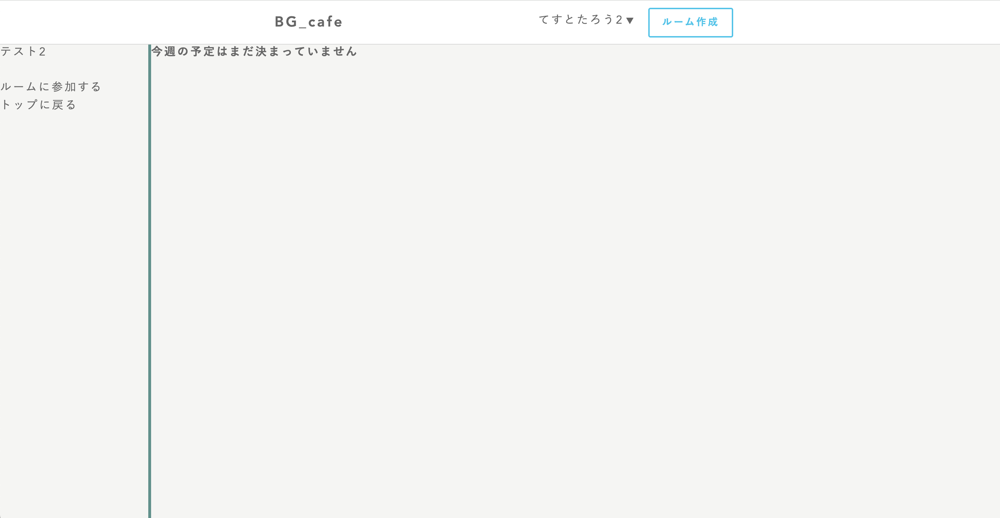
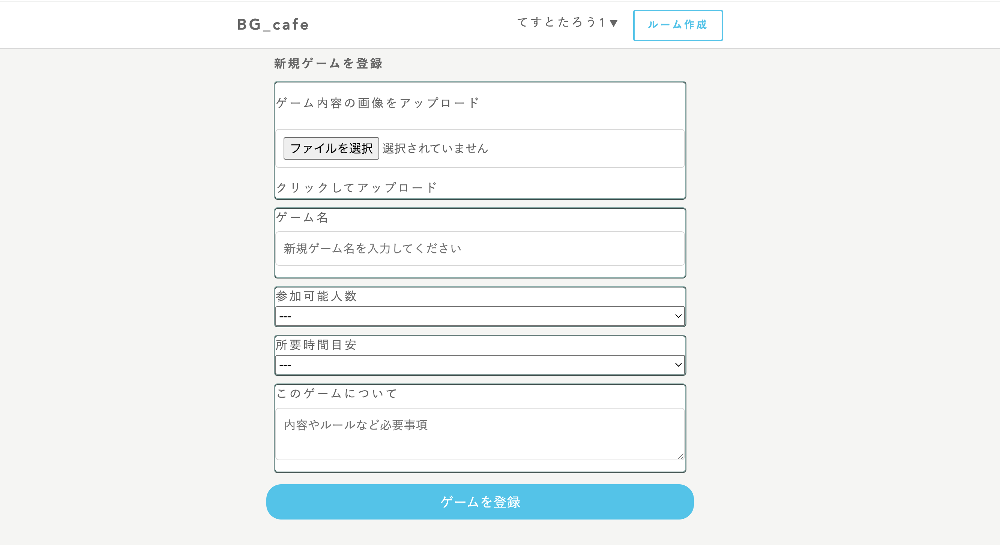
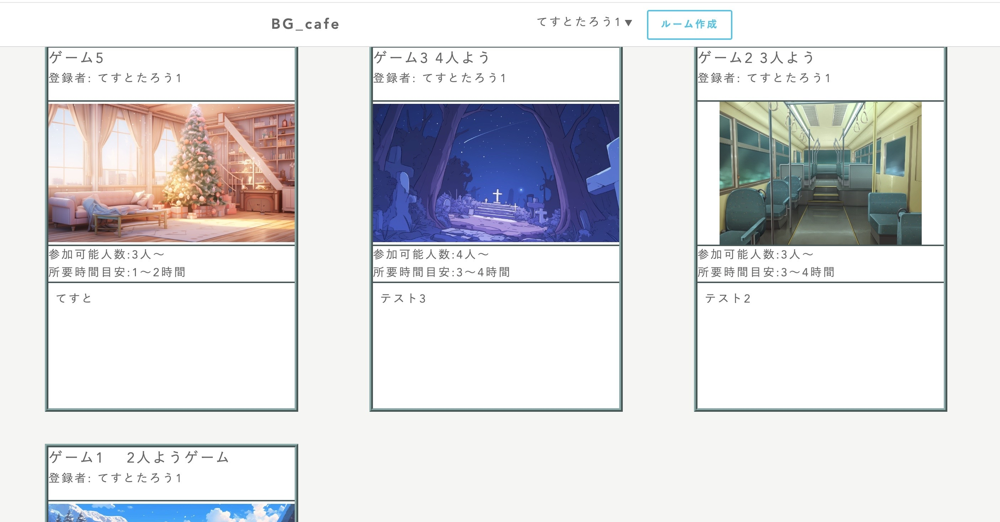
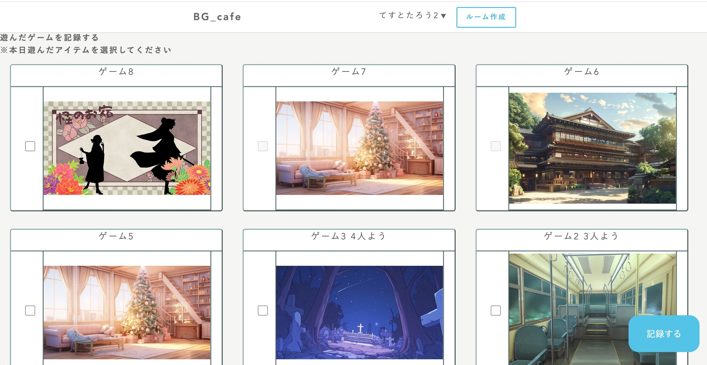
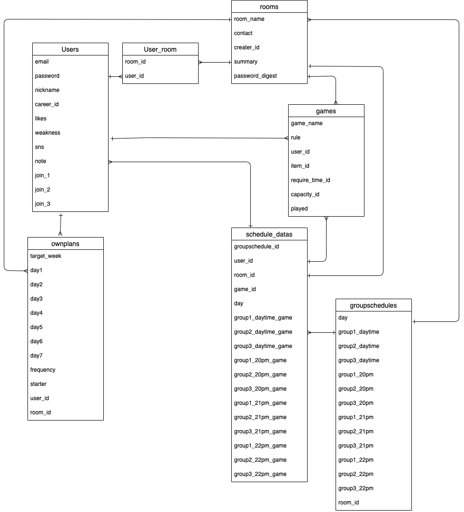
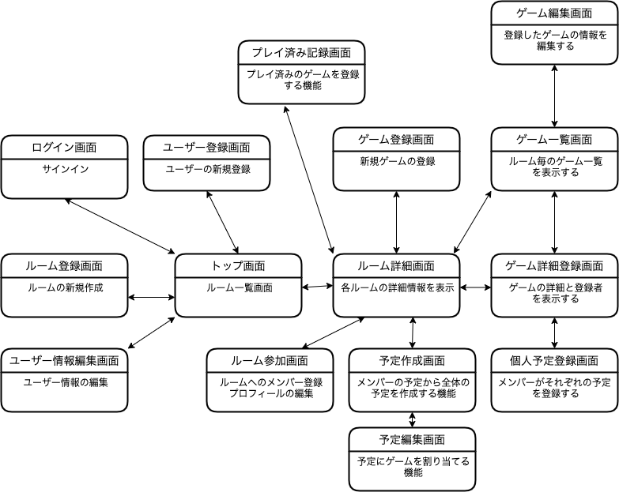

# BG_CAFE (Board Game CAFE)

## アプリケーション概要
ルームを作成し、集まったグループで予定を作成するアプリケーション。特にボードゲームで遊ぶユーザーに特化したものです。

## URL
http://18.178.195.121

## テスト用アカウント
テスト用アカウント 
- email 1@test
- password 111111

テストルーム
- password qqq111

## 利用方法
1. 右上の新規登録からユーザー登録を行う。
2. 新規ルームを作成、または既存のルームを選択する。
3. ルームに参加し、各ルームに参加が可能。（自分で作成した場合は自動でその部屋に参加）
4. 他者にお勧めしたいゲームを登録、またはプロフィールの編集ができる。
5. 予定の応募をし、各ユーザーがそこに予定登録が可能。
6. 各ユーザーの予定から、日毎に遊べるユーザーの組み合わせや、遊んだことのないゲームを表示する。

## アプリケーションを作成した背景
オンラインで仲間内で遊ぶ人たちが、簡単に予定を組むことができる。また、ユーザーが多くなれば、新しく遊ぶ仲間を探す場にもなることを期待しています。

作成の背景は、実際に友人がオンラインでボードゲームを遊ぶ際に、仲間内で予定を立てるのに時間がかかり、また多忙のため体調を崩してしまったことがあり、
それらをクリックのみで簡潔に行えるようにしたいと考えました。
## 実装した機能

- **トップ画面**
  - 作成されたルームへの入室とパスワード入力
  <video src="image_for_README/トップ画面からパスワード入力.mp4" controls>
  お使いのブラウザは動画タグをサポートしていません。
</video>

- **ルーム詳細画面**
  - 各ルームのトップページに相当するページ 

- **ルーム詳細画面2**
  - ルームにメンバー登録していない場合のメニュー表示 

- **メンバー一覧機能**
  - ルームに登録されたユーザーを一覧表示 

- **ゲーム登録機能**
  - ゲームをルームに登録する機能 

- **ゲーム一覧機能**
  - ルームに登録されたゲームを表示する機能 

- **プレイ済み登録機能**
  - プレイ済みのゲームを記録する機能 

- **個人予定登録機能**
 - 個人の予定を登録する機能
  <video src="image_for_README/個人予定登録機能.mp4" controls>
  お使いのブラウザは動画タグをサポートしていません。
</video>

- **予定作成機能**
  - 個人予定をもとに、メンバーの組み合わせと未プレイのゲームを割り出す機能
  <video src="image_for_README/予定作成機能.mp4" controls>
  お使いのブラウザは動画タグをサポートしていません。
</video>

## 実装予定の機能
- ゲーム登録欄に「ふぁぼ機能」を追加
- ルームの見た目をカスタマイズできる機能を追加

## データベース設計


## 画面遷移図


## 開発環境
- 使用言語: HTML, CSS, Ruby, JavaScript
- フレームワーク: Ruby on Rails

## ローカルでの動作方法
1. GitHubからリポジトリをクローンします。
   ```bash
   git clone https://github.com/Toshiki-Ichi/bgcafe.git
2. クローンしたディレクトリに移動します。
   ```bash
    cd bgcafe
3. 必要なGemをインストールします
   ```bash
    bundle install
4. データベースを作成します   
   ```bash
    rails db:create
5. マイグレーションを実行します
   ```bash
    rails db:migrate
6. アプリケーションを起動します
   ```bash
    rails server
## 使用技術
- カラムの名前に法則性を持たせ、繰り返し処理が容易になるよう工夫しました。

## 開発方法
大まかな挙動を記述後、ChatGPTを用いてリファクタリングを行いました。

## タスク管理
機能実装に必要な作業を細分化し、毎日のToDoを作成して進行しました。

## 改善点
現在の見た目が簡素なため、CSSでの配色変更や画像挿入などを検討しています。

## 制作時間
約15日